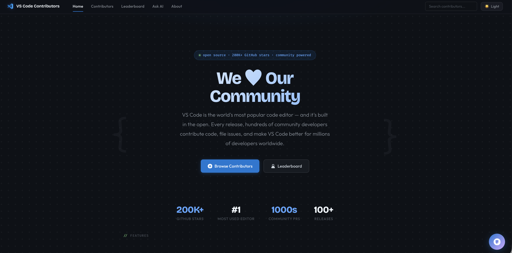
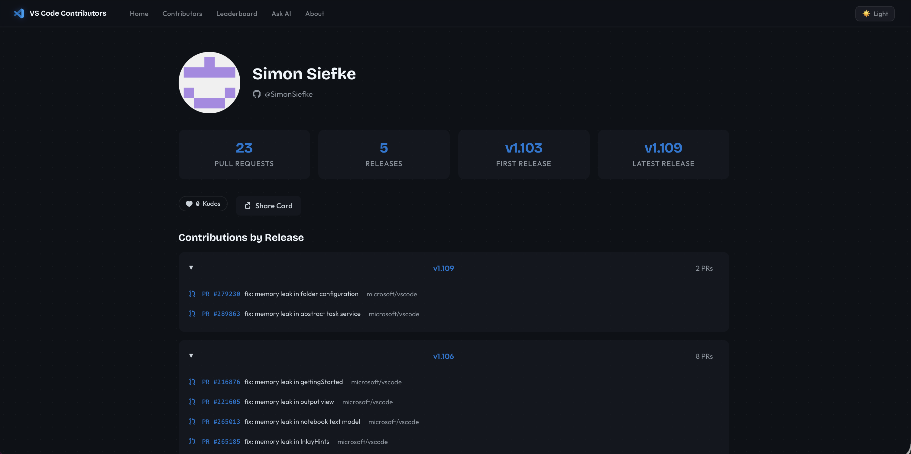
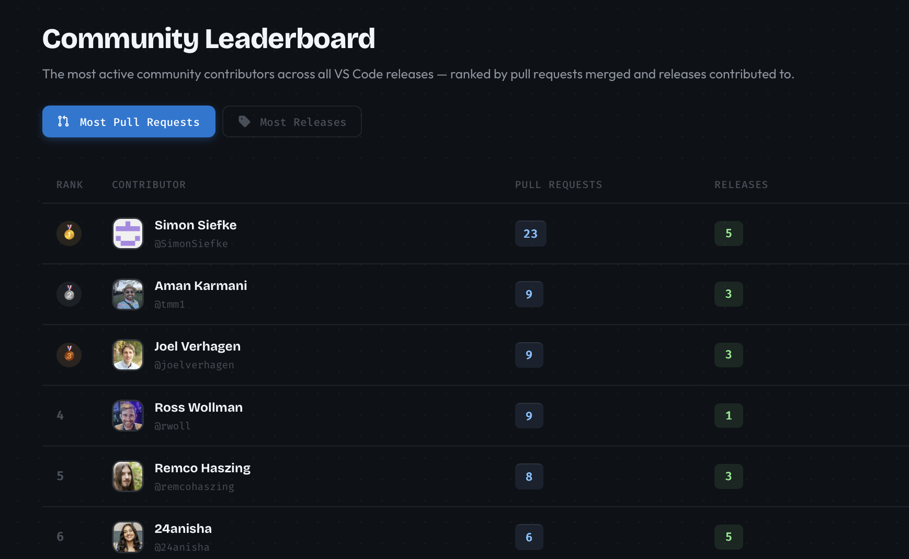

# 💙 VS Code Contributors

**Celebrate the amazing community developers who make VS Code better every release!**

A beautiful web app that showcases community contributors to Visual Studio Code by scraping release notes from the [microsoft/vscode-docs](https://github.com/microsoft/vscode-docs) repository.



## ✨ Features

### 🎯 Browse Contributors by Release
See who contributed to each VS Code release, with links to their PRs and GitHub profiles. First-time contributors get a special 🎉 badge!


### 👤 Contributor Profiles
Dedicated profile pages showing a contributor's full history across all releases, with stats like total PRs, releases contributed to, and more.



### 🏆 Community Leaderboard
See the most active contributors ranked by pull requests and releases contributed to.



### 🤖 Ask Copilot
AI-powered Q&A about contributors, releases, and PRs using GitHub Copilot integration.

### 🔍 Search
Find any contributor across all VS Code releases instantly.

### 📱 Share Cards
Generate shareable social cards for contributors at `/card/{username}`.

### 💖 Kudos
Show appreciation for contributors with kudos!

## 🚀 Quick Start

```bash
# Clone the repository
git clone https://github.com/your-username/vscode-contributor-website.git
cd vscode-contributor-website

# Run the server
go run main.go

# Open in browser
open http://localhost:8080
```

## 🛠️ Tech Stack

- **Backend**: Go (net/http)
- **Frontend**: HTML templates with embedded CSS
- **Data Source**: GitHub API → VS Code release notes markdown
- **AI**: GitHub Copilot CLI integration
- **Video**: HeyGen API for celebration videos (optional)

## 📁 Project Structure

```
├── main.go              # HTTP server and routes
├── web/                 # Web handlers and templates
│   ├── web.go           # All page handlers
│   ├── card.go          # Social sharing card generation
│   └── templates/       # HTML templates (embedded)
├── scraper/             # Release notes scraper
│   └── scraper.go       # Fetches/parses contributor data
├── copilotapi/          # Copilot integration
│   └── copilotapi.go    # AI Q&A endpoint
├── heygen/              # HeyGen video integration
├── public/static/       # Static assets (CSS)
└── api/                 # Vercel serverless functions
```

## 🌐 Routes

| Route | Description |
|-------|-------------|
| `/` | Home page |
| `/contributors` | Browse contributors by release |
| `/contributor/{username}` | Contributor profile page |
| `/leaderboard` | Top contributors ranking |
| `/search` | Search contributors |
| `/card/{username}` | Shareable PNG card |
| `/ask` | AI Q&A interface |
| `/about` | About page |

## 🔧 Environment Variables

| Variable | Description |
|----------|-------------|
| `HEYGEN_API_KEY` | (Optional) HeyGen API key for celebration videos |
| `GITHUB_TOKEN` | (Optional) GitHub token for higher API rate limits |

## 📄 License

MIT

---

**Made with 💙 for the VS Code community**
